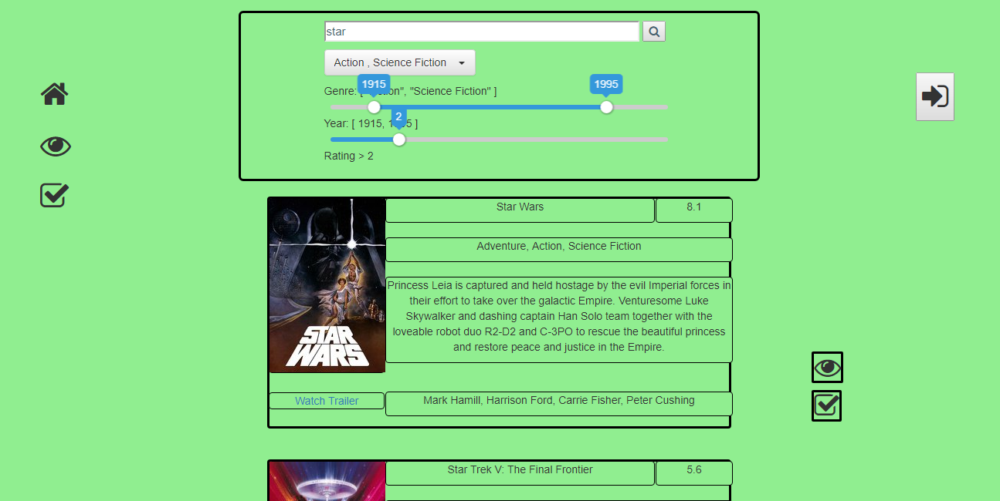

# Title tbd

Simple Website to add your favorite movies and add them to your watchlist etc. The website is powered by data from [TMDB](https://www.themoviedb.org/?language=de). The data is stored in a mongo DB. [This tool](https://github.com/ll9/tmdb2mongo/tree/master) was used to fetch the movie data from the [TMDB-API](https://www.themoviedb.org/documentation/api?language=de) and store it into mongo.
You can check out the heroku demo webpage [here](https://radiant-tor-61008.herokuapp.com/)

[](docs/assets/webpage-demonstration.mp4)

### Setup
In order to run this Website locally you will ned node + mongodb which contains the appropriate data. Furthermore in your mongodb you will have to create an text index on the title attribute (see below).
1. start your mongo database (`mongod --dbpath <path_to_database`)
2. If your db has no text index yet: In your mongo shell: 
    ```
    use <dbName>
    db.<collectionName>.createIndex({ title: "text"})
    ```
3. Install modules (only once): `npm install`
4. Start the server: `npm start`
5. Check out the website in your browser at http://localhost:3000/

#### To-do
- [ ] Implement Login (Hofmann) !
- [ ] __Design Watchlist__ (Hofmann) !
- [ ] Implement Adding to watchlist (Hofmann) !
- [ ] Implement Personal Rating (Hofmann)
- [ ] create database which stores user information (watching, rating etc.)
- [ ] Fix Movie Description (Some Descriptions are too long and overflow) (Bacher) !
- [ ] Implement search by person (might be difficult)
- [ ] Find better template picture 
- [ ] When you visit the home page it takes movies aren't displayed immediately => either cache movies to load immediately (?) or implement loading animation !
- [ ] Move Watchlist to seperate Page !
- [ ] Add Animation when you are searching for a movie (might be possible with endless scrolling Animation)
- [ ] Provide a Database with ~ 50.000 movies which also can handle user information (Wierer) !
- [ ] Fix Endless Scrolling Bug (Scrolling Animation even though there is nothing more to scroll) 
- [ ] *Make Website prettier* (Hofmann, later) !
- [ ] Optional: In the future it might be a good idea to refactore the project (multiple vue files etc, put movies class in extra file etc.)
- [ ] Append to-do list (still missing a lot)
---
- [x] Remove 'no more data' text, when endless scrolling is finished/ still loading (Wierer)
- [x] Implement dynamic loading (endless scrolling?) (Wierer) !
- [x] Think of a name for the Website (Hofmann)
- [x] Implement Slider (Year, Rating)
- [x] Integrate two sliders into year slider (f.e. select 'from 1980 to 1990' with two sliders) (Bacher)
- [x] Load some movies when you visit the page for the first time (most popular?) (Wierer)
- [x] Implement Mulit-Genre-Selection
- [x] Implement filters (Rating, Year, Genre) (Wierer)
- [x] Fix Sci-Fi Genre filter (doesn't filter correctly because 'Sci-Fi' is not the same as 'Science Fiction' (or was it the other way around?)) (Wierer)
- [x] Add year next to title (Wierer)
- [x] Let Home Button Return to homepage (Wierer)
- [x] Fix Error when there is no picture (template picture?) (Wierer)
- [x] Remove Trailer Button if there is no Trailer (Wierer)
- [x] Cast links to their tmdb page (Wierer)
- [x] Fix Rating of upcoming movies (rating: 0 to 'tbd') (Wierer)


#### Sample movie data:
```{
        "_id" : ObjectId("5a1b980d8955471028d16343"),
        "adult" : false,
        "backdrop_path" : "/z2QUexmccqrvw1kDMw3R8TxAh5E.jpg",
        "belongs_to_collection" : null,
        "budget" : 0,
        "genres" : [
                {
                        "id" : 18,
                        "name" : "Drama"
                },
                {
                        "id" : 80,
                        "name" : "Crime"
                }
        ],
        "homepage" : "",
        "id" : 2,
        "imdb_id" : "tt0094675",
        "original_language" : "fi",
        "original_title" : "Ariel",
        "overview" : "Taisto Kasurinen is a Finnish coal miner whose father has just committed suicide and who is framed for a crime he did not commit. In jail, he starts to dream about leaving the country and starting a new life. He escapes from prison but things don't go as planned...",
        "popularity" : 3.883914,
        "poster_path" : "/gZCJZOn4l0Zj5hAxsMbxoS6CL0u.jpg",
        "production_companies" : [
                {
                        "name" : "Villealfa Filmproduction Oy",
                        "id" : 2303
                },
                {
                        "name" : "Finnish Film Foundation",
                        "id" : 2396
                }
        ],
        "production_countries" : [
                {
                        "iso_3166_1" : "FI",
                        "name" : "Finland"
                }
        ],
        "release_date" : "1988-10-21",
        "revenue" : 0,
        "runtime" : 69,
        "spoken_languages" : [
                {
                        "iso_639_1" : "fi",
                        "name" : "suomi"
                },
                {
                        "iso_639_1" : "de",
                        "name" : "Deutsch"
                }
        ],
        "status" : "Released",
        "tagline" : "",
        "title" : "Ariel",
        "video" : false,
        "vote_average" : 7.1,
        "vote_count" : 45,
        "videos" : {
                "results" : [ ]
        },
        "credits" : {
                "cast" : [
                        {
                                "cast_id" : 3,
                                "character" : "Taisto Olavi Kasurinen",
                                "credit_id" : "52fe420dc3a36847f8000029",
                                "gender" : 0,
                                "id" : 54768,
                                "name" : "Turo Pajala",
                                "order" : 0,
                                "profile_path" : null
                        },
                        {
                                "cast_id" : 4,
                                "character" : "Irmeli Katariina Pihlaja",
                                "credit_id" : "52fe420dc3a36847f800002d",
                                "gender" : 0,
                                "id" : 54769,
                                "name" : "Susanna Haavisto",
                                "order" : 1,
                                "profile_path" : null
                        },
                        {
                                "cast_id" : 5,
                                "character" : "Mikkonen",
                                "credit_id" : "52fe420dc3a36847f8000031",
                                "gender" : 2,
                                "id" : 4826,
                                "name" : "Matti Pellonpää",
                                "order" : 2,
                                "profile_path" : "/7WuLvkuWphUAtW6QQwtF3WrwUKE.jpg"
                        },
                        {
                                "cast_id" : 6,
                                "character" : "Riku",
                                "credit_id" : "52fe420dc3a36847f8000035",
                                "gender" : 0,
                                "id" : 54770,
                                "name" : "Eetu Hilkamo",
                                "order" : 3,
                                "profile_path" : null
                        }
                ],
                "crew" : [
                        {
                                "credit_id" : "52fe420dc3a36847f800001f",
                                "department" : "Writing",
                                "gender" : 0,
                                "id" : 16767,
                                "job" : "Screenplay",
                                "name" : "Aki Kaurismäki",
                                "profile_path" : "/8nQcTzKUmRh6MPprd1n6iOauYPf.jpg"
                        },
                        {
                                "credit_id" : "52fe420dc3a36847f8000025",
                                "department" : "Directing",
                                "gender" : 0,
                                "id" : 16767,
                                "job" : "Director",
                                "name" : "Aki Kaurismäki",
                                "profile_path" : "/8nQcTzKUmRh6MPprd1n6iOauYPf.jpg"
                        },
                        {
                                "credit_id" : "52fe420dc3a36847f800003b",
                                "department" : "Camera",
                                "gender" : 2,
                                "id" : 16769,
                                "job" : "Director of Photography",
                                "name" : "Timo Salminen",
                                "profile_path" : null
                        },
                        {
                                "credit_id" : "52fe420dc3a36847f8000041",
                                "department" : "Editing",
                                "gender" : 0,
                                "id" : 54766,
                                "job" : "Editor",
                                "name" : "Raija Talvio",
                                "profile_path" : null
                        },
                        {
                                "credit_id" : "52fe420dc3a36847f8000047",
                                "department" : "Art",
                                "gender" : 2,
                                "id" : 53836,
                                "job" : "Production Design",
                                "name" : "Risto Karhula",
                                "profile_path" : null
                        },
                        {
                                "credit_id" : "52fe420dc3a36847f800004d",
                                "department" : "Costume & Make-Up",
                                "gender" : 0,
                                "id" : 54771,
                                "job" : "Costume Design",
                                "name" : "Tuula Hilkamo",
                                "profile_path" : null
                        }
                ]
        }
}
```

#### Get Picture/Trailer:
##### Picture
Path = base_url +  file_size + file_path
base_url = https://image.tmdb.org/t/p/
file_size = (for example) w500/ 
file_path = (f.e.) gZCJZOn4l0Zj5hAxsMbxoS6CL0u.jpg
url = https://image.tmdb.org/t/p/w500/gZCJZOn4l0Zj5hAxsMbxoS6CL0u.jpg

##### Trailer
base url = https://www.youtube.com/watch?v=
path = (f.e.) 7j8Ba9rWhUg 
url = https://www.youtube.com/watch?v=7j8Ba9rWhUg
Note: Example above has no trailer 

