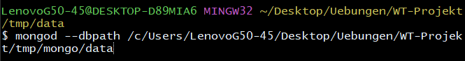
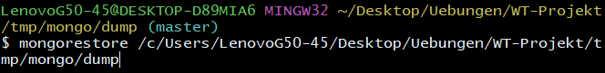
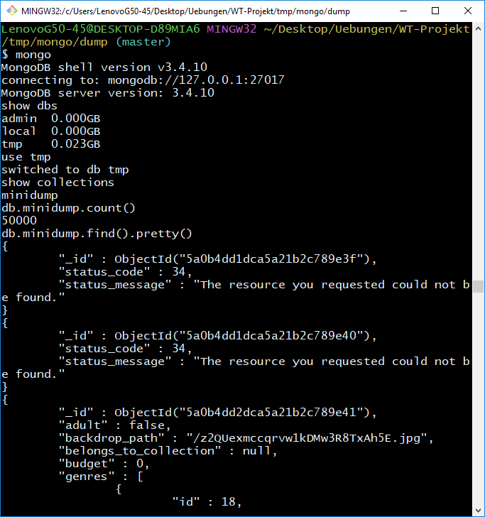

# TMDB Dump containing ~ 50000 movies

This demo database contains about 50.000 movies from [TMDB](https://www.themoviedb.org/?language=de). In order to get the data you have to register for an api key. Then you can iterate over each movie-id in order to fetch the data.

### Instructions to restore dump
1. `mongod --dbpath PATH_TO_DATA_FOLDER`
2. `mongorestore PATH_TO_DUMP_FOLDER`(still running 1.)

##### Open Questions
* What additional information should the real database contain ([Credits, Videos, Similar Movies, Reviews, ...](https://developers.themoviedb.org/3/movies))? This demo database only contains the basic information you get from http://api.themoviedb.org/3/movie/<MOVIE_ID>?api_key=<API_KEY>
* Will the database perform well enough with ~ 500.000 movies + additional information?

##### Detailed Instructions
-
-

##### Example
-
